# UVCCamera and libuvc Interaction Sequence Diagram

```mermaid
sequenceDiagram
    participant App as Android App
    participant JNI as UVCCamera JNI
    participant UVC as UVCCamera C++
    participant Preview as UVCPreview
    participant LIBUVC as libuvc
    participant USB as libusb

    Note over App,USB: Camera Initialization and Connection

    App->>JNI: nativeCreate()
    JNI->>UVC: new UVCCamera()
    UVC-->>JNI: camera instance
    JNI-->>App: camera handle

    App->>JNI: nativeConnect(vid, pid, fd, ...)
    JNI->>UVC: connect(vid, pid, fd, ...)
    UVC->>LIBUVC: uvc_init2(&mContext, NULL, mUsbFs)
    LIBUVC->>USB: libusb_init()
    USB-->>LIBUVC: context
    LIBUVC-->>UVC: uvc_context

    UVC->>LIBUVC: uvc_get_device_with_fd(...)
    LIBUVC->>USB: libusb_wrap_sys_device()
    USB-->>LIBUVC: device
    LIBUVC-->>UVC: uvc_device

    UVC->>LIBUVC: uvc_open(mDevice, &mDeviceHandle)
    LIBUVC->>USB: libusb_open()
    USB-->>LIBUVC: device_handle

    Note over LIBUVC,USB: Supported Formats Discovery
    LIBUVC->>LIBUVC: uvc_get_device_info()
    LIBUVC->>USB: libusb_get_config_descriptor()
    USB-->>LIBUVC: config descriptor

    LIBUVC->>LIBUVC: uvc_scan_control()
    Note right of LIBUVC: Find Video Control Interface<br/>(bInterfaceClass=14, bInterfaceSubClass=1)

    LIBUVC->>LIBUVC: uvc_parse_vc_header()
    loop For each Streaming Interface
        LIBUVC->>LIBUVC: uvc_scan_streaming()
        LIBUVC->>LIBUVC: uvc_parse_vs()
        Note right of LIBUVC: Parse descriptors:<br/>- UVC_VS_FORMAT_UNCOMPRESSED<br/>- UVC_VS_FORMAT_MJPEG<br/>- UVC_VS_FRAME_*
        LIBUVC->>LIBUVC: uvc_parse_vs_format_*()
        LIBUVC->>LIBUVC: uvc_parse_vs_frame_*()
        Note right of LIBUVC: Store in structures:<br/>- uvc_format_desc_t<br/>- uvc_frame_desc_t
    end

    LIBUVC-->>UVC: uvc_device_handle with complete format info

    UVC->>UVC: new UVCStatusCallback()
    UVC->>UVC: new UVCButtonCallback()
    UVC->>Preview: new UVCPreview(mDeviceHandle)

    UVC-->>JNI: connection status
    JNI-->>App: success/error

    Note over App,USB: Get Supported Formats (on demand)

    opt Application requests formats
        App->>JNI: nativeGetSupportedSize()
        JNI->>UVC: getSupportedSize()
        UVC->>UVC: UVCDiags.getSupportedSize(mDeviceHandle)

        loop Iterate through all formats
            UVC->>UVC: DL_FOREACH(stream_ifs)
            UVC->>UVC: DL_FOREACH(format_descs)
            UVC->>UVC: DL_FOREACH(frame_descs)
            Note right of UVC: Build JSON:<br/>{"formats": [<br/>  {"size": ["640x480", "1280x720"]}<br/>]}
        end

        UVC-->>JNI: JSON string with formats
        JNI-->>App: supported formats JSON
    end

    Note over App,USB: Preview Setup

    App->>JNI: nativeSetPreviewSize(width, height, ...)
    JNI->>UVC: setPreviewSize(...)
    UVC->>Preview: setPreviewSize(...)
    Preview->>LIBUVC: uvc_get_stream_ctrl_format_size_fps()
    LIBUVC-->>Preview: stream_ctrl
    Preview-->>UVC: result
    UVC-->>JNI: result
    JNI-->>App: result

    App->>JNI: nativeSetPreviewDisplay(surface)
    JNI->>UVC: setPreviewDisplay(window)
    UVC->>Preview: setPreviewDisplay(window)
    Preview-->>UVC: result
    UVC-->>JNI: result
    JNI-->>App: result

    Note over App,USB: Start Streaming

    App->>JNI: nativeStartPreview()
    JNI->>UVC: startPreview()
    UVC->>Preview: startPreview()

    Preview->>Preview: pthread_create(preview_thread)
    Preview->>LIBUVC: uvc_start_streaming_bandwidth(...)

    LIBUVC->>USB: libusb_submit_transfer()
    USB-->>LIBUVC: transfer submitted

    LIBUVC->>LIBUVC: start event handler thread
    LIBUVC-->>Preview: streaming started

    Preview-->>UVC: result
    UVC-->>JNI: result
    JNI-->>App: result

    Note over App,USB: Frame Processing Loop

    loop Frame Processing
        USB->>LIBUVC: transfer completed callback
        LIBUVC->>LIBUVC: _uvc_process_payload()
        LIBUVC->>Preview: uvc_preview_frame_callback()

        Preview->>Preview: addPreviewFrame()
        Preview->>Preview: preview_thread wakeup

        Preview->>Preview: waitPreviewFrame()
        Preview->>Preview: draw_preview_one()
        Preview->>Preview: format conversion (if needed)
        Preview->>Preview: render to ANativeWindow

        opt Frame callback enabled
            Preview->>JNI: frame callback to Java
            JNI->>App: onFrame(data)
        end
    end

    Note over App,USB: Camera Controls

    App->>JNI: nativeSetBrightness(value)
    JNI->>UVC: setBrightness(value)
    UVC->>UVC: internalSetCtrlValue()
    UVC->>LIBUVC: uvc_set_brightness()
    LIBUVC->>USB: libusb_control_transfer()
    USB-->>LIBUVC: control result
    LIBUVC-->>UVC: result
    UVC-->>JNI: result
    JNI-->>App: result

    Note over App,USB: Cleanup and Release

    App->>JNI: nativeStopPreview()
    JNI->>UVC: stopPreview()
    UVC->>Preview: stopPreview()
    Preview->>LIBUVC: uvc_stop_streaming()
    LIBUVC->>USB: libusb_cancel_transfer()
    USB-->>LIBUVC: transfers cancelled
    LIBUVC-->>Preview: streaming stopped
    Preview->>Preview: pthread_join(preview_thread)
    Preview-->>UVC: result
    UVC-->>JNI: result
    JNI-->>App: result

    App->>JNI: nativeDestroy()
    JNI->>UVC: ~UVCCamera()
    UVC->>UVC: release()
    UVC->>Preview: delete UVCPreview
    UVC->>LIBUVC: uvc_close(mDeviceHandle)
    LIBUVC->>USB: libusb_close()
    UVC->>LIBUVC: uvc_unref_device()
    UVC->>LIBUVC: uvc_exit(mContext)
    LIBUVC->>USB: libusb_exit()
    UVC-->>JNI: destruction complete
    JNI-->>App: destruction complete
```



## Key Interactions

### 1. Architecture Layers
- **Android App**: Java application layer
- **UVCCamera JNI**: JNI interface (serenegiant_usb_UVCCamera.cpp)
- **UVCCamera C++**: Main class (UVCCamera.cpp, UVCCamera.h)
- **UVCPreview**: Preview and frame capture management
- **libuvc**: Cross-platform UVC library
- **libusb**: Low-level USB library

### 2. Core Interaction Components

#### UVCCamera Class:
- Manages connection lifecycle
- Encapsulates libuvc functions
- Contains UVCPreview, UVCStatusCallback, UVCButtonCallback
- Handles camera parameters (brightness, contrast, focus, etc.)

#### UVCPreview Class:
- Manages preview and capture threads
- Handles frame format conversion
- Renders to ANativeWindow
- Manages frame pool for performance optimization

#### libuvc Library:
- Provides abstraction over libusb for UVC devices
- Manages USB descriptors and endpoints
- Handles streaming data
- Provides camera control functions

### 3. Execution Threads

1. **Event Handler Thread** (libuvc): Handles USB events
2. **Preview Thread** (UVCPreview): Renders frames to preview window
3. **Capture Thread** (UVCPreview): Processes frame capture for callbacks

### 4. Data Types and Interfaces

- **uvc_frame_t**: Frame structure with metadata
- **uvc_device_handle_t**: Handle to opened UVC device
- **uvc_stream_ctrl_t**: Stream parameters (format, size, FPS)
- **ANativeWindow**: Android native window for rendering

### 5. Supported Formats Discovery Process

Occurs automatically when opening UVC device through function call chain:

1. **uvc_open()** → **uvc_get_device_info()**
   - Gets USB configuration descriptors via `libusb_get_config_descriptor()`

2. **uvc_scan_control()**
   - Finds Video Control interface (`bInterfaceClass=14, bInterfaceSubClass=1`)
   - Parses control descriptors

3. **uvc_parse_vc_header()** → **uvc_scan_streaming()** (for each streaming interface)
   - Creates `uvc_streaming_interface_t` structures
   - Parses streaming interface descriptors

4. **uvc_parse_vs()** → **uvc_parse_vs_format_*()**
   - Parses format descriptors:
     - `UVC_VS_FORMAT_UNCOMPRESSED` (YUV, RGB)
     - `UVC_VS_FORMAT_MJPEG` (Motion JPEG)
   - Creates `uvc_format_desc_t` structures

5. **uvc_parse_vs_frame_*()**
   - Parses frame descriptors for each format
   - Creates `uvc_frame_desc_t` with dimensions (width, height) and FPS
   - Stores in linked lists

#### Data Structures for Format Storage:
```cpp
uvc_device_info_t
├── stream_ifs (uvc_streaming_interface_t*)
    ├── format_descs (uvc_format_desc_t*)
        ├── bFormatIndex, bDescriptorSubtype
        └── frame_descs (uvc_frame_desc_t*)
            ├── wWidth, wHeight
            ├── intervals (FPS)
            └── dwMaxVideoFrameBufferSize
```

#### Application Format Retrieval:
- **getSupportedSize()** iterates through all structures and builds JSON
- Called on demand from Java via JNI
- Returns JSON with formats: `{"formats": [{"size": ["640x480", "1280x720"]}]}`

### 6. Resource Management

- Automatic object lifecycle management
- Frame pools for allocation minimization
- Proper USB resource cleanup
- Thread-safe operations with synchronization
